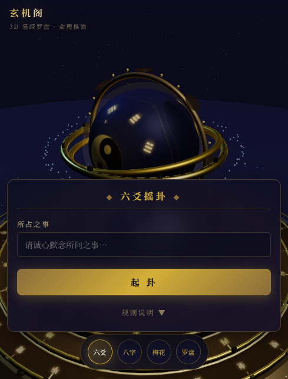

# 🧭 玄机阁 · 3D易经罗盘

> 融合现代3D科技与传统易经文化的交互式命理推演平台

<div align="center">



**一款基于 Three.js 构建的 3D 浑天仪易经罗盘，支持六爻摇卦、八字命理、梅花易数等多种传统测算方式。**

[🚀 在线体验](https://yannyn3.github.io/3d--/) | [📖 功能说明](#-功能特性) | [🎯 使用指南](#-使用指南)

</div>

---

## ✨ 功能特性

### 🌐 3D 浑天仪展示
- **高精度3D球体**：基于 Three.js 构建的浑天仪造型，融合八卦、太极等核心元素
- **动态旋转**：球体自动缓慢旋转，可拖拽360°旋转查看，起卦时加速转动
- **神性文字**：八卦符号带自发光效果，深度融入球体表面，呈现科技感与玄学气息
- **悬浮全息**：球体与底座分离的悬浮效果，配合星空背景营造玄妙氛围

### 🔮 六爻摇卦（龟壳起卦）
- **拟真摇卦**：模拟将钱币放入龟壳、摇动龟壳的真实动作
- **严格规则**：遵循传统六爻起卦规则（老阴/老阳/少阴/少阳），6次摇卦生成完整卦象
- **深度解读**：结合所占之事自动识别类型（事业/感情/财运/健康/学业），给出针对性白话解读
- **变卦推演**：自动计算变卦、动爻爻辞，完整呈现卦象变化
- **一键复制**：将卦象以 Markdown 格式复制，方便发给 AI 深入分析

### 📜 八字命理（四柱排盘）
- **完整排盘**：年月日时四柱，含天干地支、五行属性
- **丰富信息**：十神分析、纳音五行、五行旺衰、喜用神、忌神
- **深度解析**：大运走势、性格特征、事业财运、感情婚姻、健康提示
- **历法选择**：支持新历（公历）/农历（阴历）两种输入方式

### 🌸 梅花易数（起卦）
- **多种起卦方式**：时间起卦、数字起卦
- **体用分析**：传统体用生克判断吉凶
- **完整卦象**：本卦、变卦、卦辞、白话解读

### 📐 罗盘系统
- **多圈层罗盘**：二十八宿、二十四山、十二地支、天干、九星、先天八卦
- **机械朋克底座**：细节丰富的科技感底座，随拖拽旋转
- **专业刻度**：参考实物罗盘外观设计

### 📱 多端适配
- **PC / 平板 / 手机** 全平台响应式适配
- **触摸操作**：单指拖拽旋转、双指缩放
- **性能优化**：移动端自动降低渲染负载，保证流畅体验

---

## 🎯 使用指南

### 六爻摇卦
1. 点击左侧 **六爻** 按钮
2. 在输入框内**诚心默念**所占之事（如："近期工作运程如何？"）
3. 点击 **起卦** 按钮，观察龟壳摇卦动画
4. 等待卦象生成，查看本卦、变卦、卦辞和白话解读
5. 点击 **复制卦象** 可将结果复制给 AI 分析

### 八字排盘
1. 点击左侧 **八字** 按钮
2. 选择历法（新历/农历）
3. 填写出生年、月、日、时和性别
4. 点击 **排盘**，查看完整命盘分析

### 梅花易数
1. 点击左侧 **梅花** 按钮
2. 选择起卦方式（时间/数字）
3. 输入所占之事或数字
4. 点击 **起卦**，查看体用分析和卦象

### 罗盘查看
1. 点击左侧 **罗盘** 按钮
2. 拖拽浑天仪球体360°旋转查看
3. 拖拽底座罗盘查看不同圈层信息

---

## 🛠️ 技术架构

| 技术 | 用途 |
|------|------|
| **Three.js** | 3D 场景渲染（浑天仪、罗盘、星空） |
| **原生 JavaScript** | 业务逻辑与测算算法 |
| **Canvas 2D** | 纹理生成（球体纹理、罗盘纹理） |
| **HTML5 / CSS3** | 响应式界面与动画 |

### 目录结构
```
3d--/
├── index.html          # 主程序（含全部逻辑）
├── three.min.js        # Three.js 3D引擎
├── README.md           # 项目说明
├── screenshots/        # 界面截图
│   ├── main.png        # 主界面
│   ├── bazi.png        # 八字面板
│   ├── meihua.png      # 梅花面板
│   └── luopan.png      # 罗盘展示
└── OrbitControls.js    # 3D控制器
```

---

## 🎨 界面预览

### 主界面 · 六爻摇卦


### 八字命理


### 梅花易数


### 罗盘展示


---

## 🚀 本地运行

### 方式一：直接打开
直接用浏览器打开 `index.html` 文件即可使用。

### 方式二：本地服务器（推荐）
```bash
# Python 方式
cd 3d--
python -m http.server 8080
# 浏览器访问 http://localhost:8080

# Node.js 方式
npx serve .
```

---

## 📜 免责声明

> 本应用仅供 **文化研究与娱乐参考**，不作为任何决策依据。易经命理是中国传统文化的组成部分，其科学性尚有争议，请理性看待。所有测算结果仅供参考，不构成专业建议。

---

## 📄 License

本项目仅用于学习和文化研究目的，欢迎自由使用与二次开发。

<div align="center">

**玄机阁 · 3D易经罗盘** — 传承千年智慧，融合现代科技

</div>
